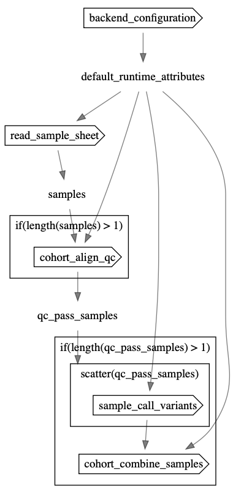

# CoLoRS

These workflows are written in [Workflow Description Language (WDL)](https://openwdl.org/).

## Workflow

The cohort-level CoLoRS workflow performs alignment, quality control, variant calling, joint-calling small variants and structural variants for a cohort. The workflow can run using Azure, AWS, GCP, and HPC backends.

**Workflow entrypoint**: [wdl/workflows/main.wdl](wdl/workflows/main.wdl)

## Documentation

- [Tutorial](docs/tutorial.md)
- [Inputs](docs/inputs.md)
- [Outputs](docs/outputs.md)
- [Analysis](docs/analysis.md)
- [Dockers](docs/dockers.md)

## Need help?
If you notice any missing features, bugs, or need assistance with analyzing the output, please don't hesitate to [reach out by email](mailto:jlake@pacificbiosciences.com) or open a GitHub issue.
