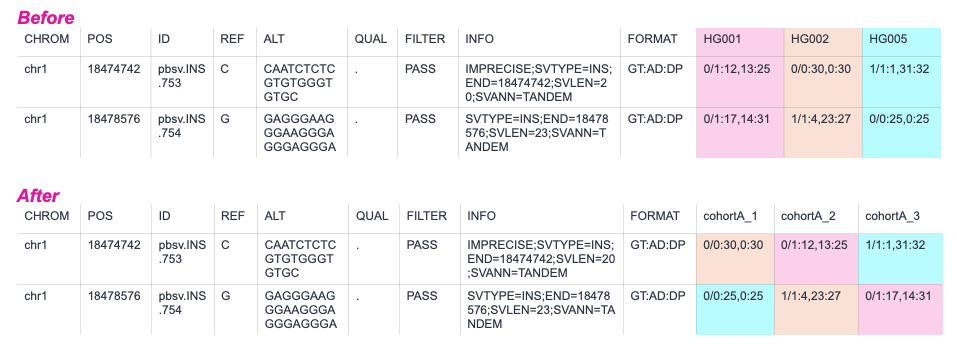

# Analysis

The [cohort analysis](#cohort-analysis) is broken up into three main sub-workflows:

- [Sample-level quality control](#sample-level-quality-control)
- [Call variants](#call-variants)
- [Merge samples](#merge-samples)

The [multi-cohort analysis](#multi-cohort-analysis) then handles the following tasks:

- [Variant-level quality control](#variant-level-quality-control)
- [Merge cohorts](#merge-cohorts)

## Cohort analysis

### Sample-level quality control

The [cohort_align_and_qc workflow](../wdl/workflows/cohort_align_qc/cohort_align_qc.wdl) handles [alignment](#alignment) and [sample filtering](#sample-filtering) based on several quality control criteria. 

#### Alignment

HiFi reads are aligned with [pbmm2](https://github.com/PacificBiosciences/pbmm2), which accepts FASTQ or BAM files as input. Before alignment, previously aligned BAMs are [reset](../wdl/workflows/cohort_align_qc/cohort_align_qc.wdl#L30) with [samtools](https://github.com/samtools) to ensure that all reads are subject to the same alignment parameters and to accommodate alignment to new reference genomes.

If multiple inputs files (FASTQ and/or BAM) are present for a single sample, the alignment are eventually merged into a single file before calling variants.

#### Sample filtering

After alignment, several quality control steps are performed using a combination of [somalier](https://github.com/brentp/somalier) and [a custom script](../docker/somalier/scripts/screen_related_samples.py). The priority of this step is to remove the minimum number of samples (prioritizing those with highest coverage) such that the following quality control standards are met:

- All input files (BAM/FASTQ) associated with an individual sample have genetic relatedness ≥ 0.7
  - How: targeted genotypes are extracted from each aligned movie, if pairwise relatedness for any two movies associated with a sample exceeds this threshold then the sample is removed from the cohort and not used for variant calling
  - The relatedness threshold (0.7) was chosen after running several tests on low- medium- and high-coverage movies. It is intended to be low enough such that low coverage will not be mistaken for a sample swap, but high enough such that a sample swap with a full sibling, parent, or child will still be caught
- Inferred sex is unambiguous
  - How: after all aligned BAMs are merged for a sample, targeted genotypes are extracted from the BAM and sex is inferred by somalier using chrX and chrY genotypes
- Pairwise genetic relatedness for any two samples is ≤ 0.125
  - How: after all aligned BAMs are merged for a sample, targeted genotypes are extracted from the BAM and used to calculate genetic relatedness with every other sample in the cohort. If two or more samples are considered "relatives", then samples are recursively removed until all pairwise relatedness values are below the threshold
  - The priority of this step is to remove the minimum number of samples such that there are no "relatives" within a cohort, while prioritizing samples with highest coverage

Samples that pass all quality control steps are then passed to the variant calling workflow.

### Call variants

The [sample_call_variants workflow](../wdl/workflows/sample_call_variants/sample_call_variants.wdl) calls variants on a per-sample basis with the following tools, using recommended parameters for each tool. For additional information on tool versions, please see the [dockers page](dockers.md).

| Tool | Variant type | Output | Notes |
| :- | :- | :-: | :- |
| DeepVariant | SNVs, insertions, deletions | gVCF | |
| pbsv | insertions, deletions, inversions | SVSIG | Called per chromosome to improve memory and runtime. SV types are limited to INS,DEL, INV to improve later merging. |
| Sniffles2 | insertions, deletions, inversions, duplications, breakends | SNF | |
| TRGT | tandem repeats | VCF | |
| HiFiCNV | CNVs | VCF | The output VCF is modified (variant ID added, quality moved to genotype field) to improve later merging. |

### Merge samples

The [cohort_combine_samples workflow](../wdl/workflows/cohort_combine_samples/cohort_combine_samples.wdl) can be divided in [variant merging](#variant-merging) and [postprocessing](#postprocessing).

#### Variant merging
The following tools are used with recommended paramters to merge variants or joint call samples in a caller-specific manner. For additional information on tool versions, please see the [dockers page](dockers.md).

| Merging tool | Variant caller | Notes |
| :- | :- | :- |
| GLnexus | DeepVariant | |
| pbsv | pbsv | Variants are joint called per chromosome and then concatenated with bcftools. |
| Sniffles2 | Sniffles2 | |
| [custom script](../docker/vcfparser/scripts/merge_trgt_vcfs.py) | TRGT | A custom script is used because the TRGT VFC does not adhere to VCF specifications. |
| bcftools | HiFiCNV | |

The output of each of these steps is a zipped, indexed, multi-sample VCF.

#### Postprocessing

Postprocessing of each zipped, indexed, multi-sample VCF is achieved with a [custom script](../docker/vcfparser/scripts/postprocess_joint_vcf.py) and includes the following steps:

- Correct ploidy of chrX and chrY according to a sample's inferred sex
  - This step is not necessary for TRGT output which outputs haploid genotypes for relevant loci if a "karyotype" is specified
- Remove sample names from headerline and replace with generic placeholders
- Randomly shuffle genotypes for each variant (see example below)
  - This step only occurs is `anonymize_output = true`

## Multi-cohort analysis

This workflow is still under development. Details coming soon!

### Variant-level quality control

### Merge cohorts
